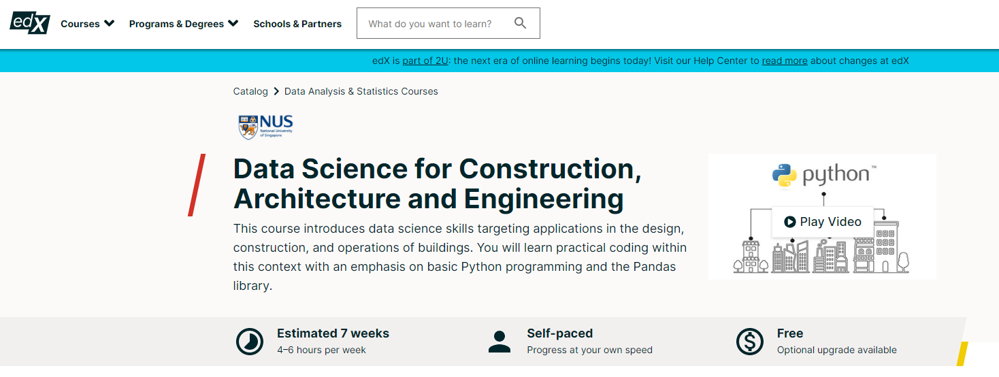
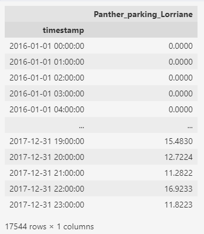

<!-- _class: invert -->
# Apresentação

- Me chamo Bruno Perdigão. Sou arquiteto e trabalho com desenvolvimento de projetos de edificações.
- Comecei a estudar python para desenvolver meus conhecimentos sobre design computacional e acabei entrando em contato com o mundo da Ciência de Dados.
- Atualmente estou me qualificando nesta área e busco aliar meus novos conhecimentos com a minha experiênciam em arquitetura.

---

---

<!-- _footer: Curso criado por Clayton Miller - Professor assistente na National University of Singapore -->

---

# O conjunto de dados

Os dados utilizados para esse trabalho foram fornecidos no curso do prof. Clayton Miller mencionado anteriormente. É formado pela mediação de gastos energéticos de edificações, medido por sensores. Parte desse conjunto é formado por dados publicamente disponíveis e outros foram feitos a partir da coleta privada em reuniões e visitas à setores de manutenção de edifícios.

---

<!-- _footer: Para manter a privacidade dos dados não publicizados foram utilizados "apelidos" para nomear o local e o edifício. A nomenclatura das colunas obedece a seguinte lógica: (Apelido do Local)_(Uso da edificação)_(Apelido do Edifício). Todas as medições dos dados de consumo elétricos foram convertidos para __kWh__. -->

---

